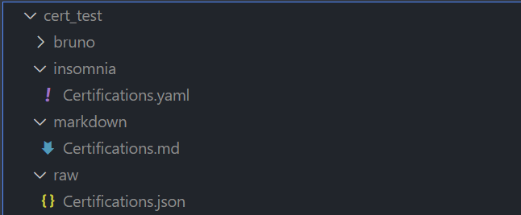
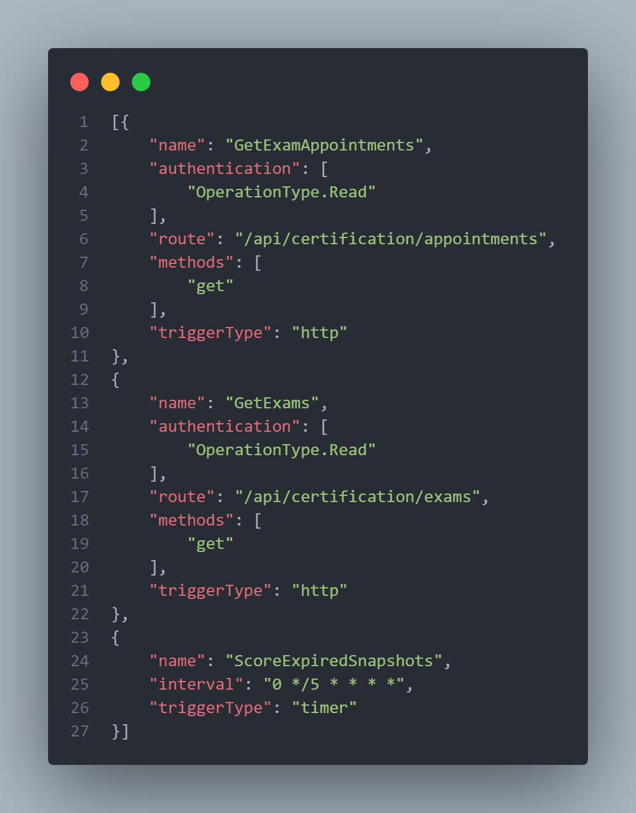
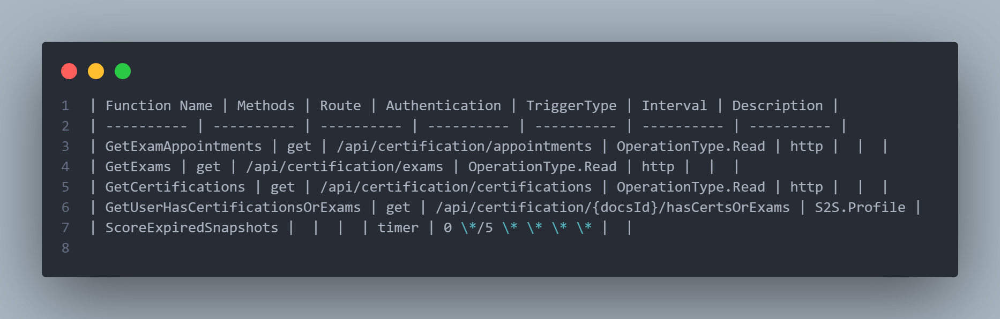
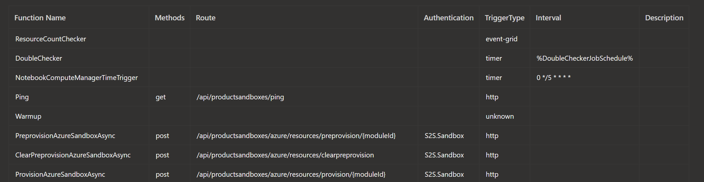
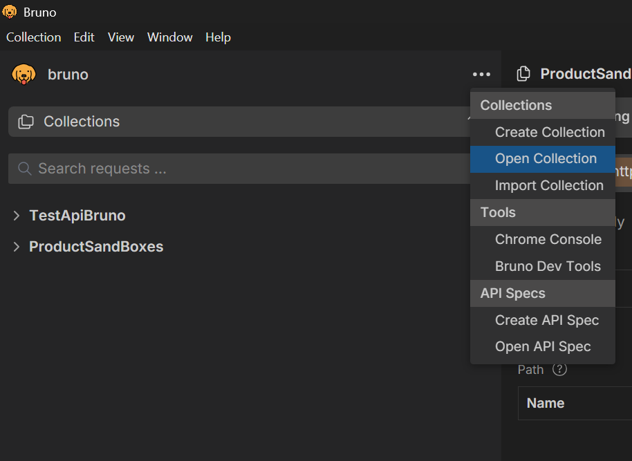
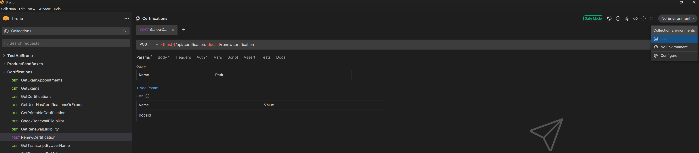
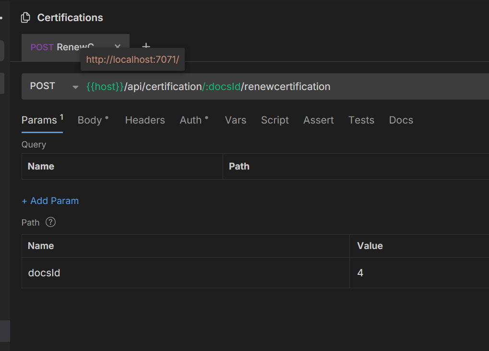
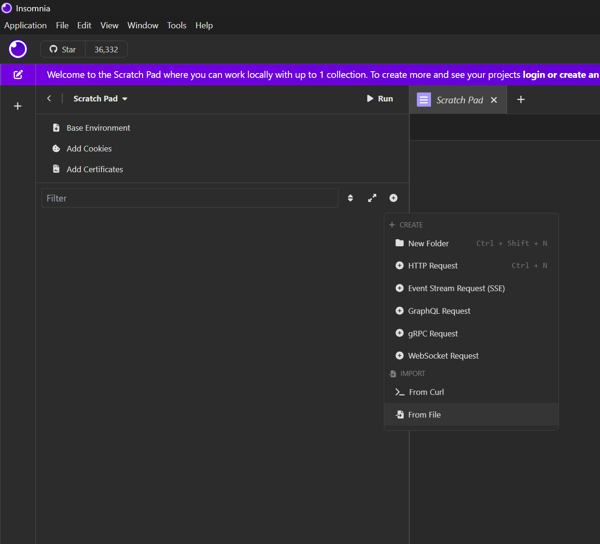
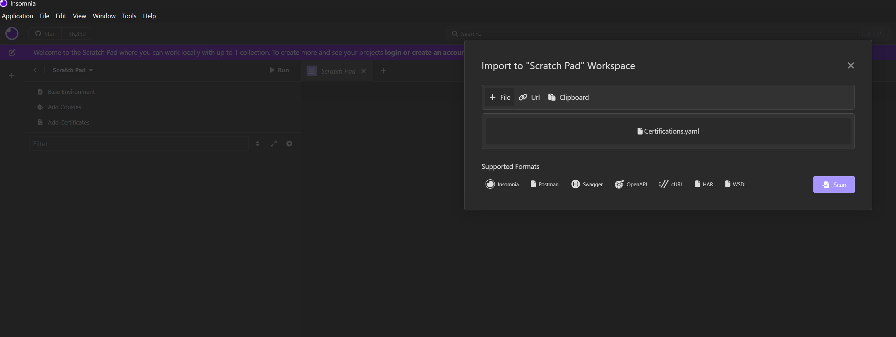
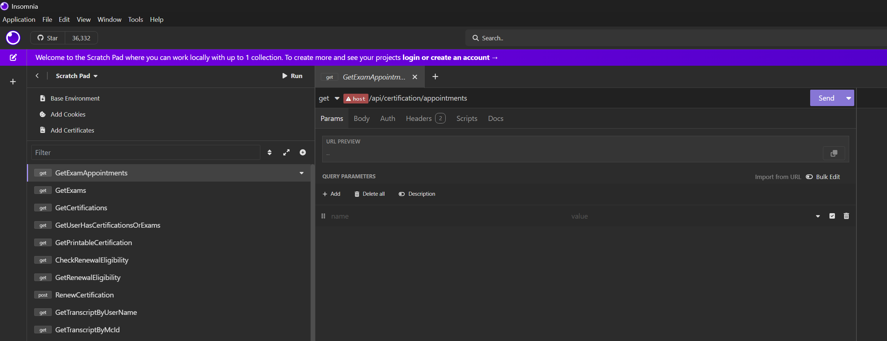

# ✍️ Document Api

"Document Api" is tool to parse our dotnet APIs/Functions and generate documentation. The idea arises from the fact that
documentation for endpoints are not always up to date. This ranges from OpenApi decorators not being updated as an endpoint
is changed (or OpenApi decorators missing altogether), to out of date README description of endpoints.

Document Api supports multiple output formats for documentation, including `bru` or `yaml` files to import Requests into bruno
and insomnia, markdown files that can used to update our Repo READMEs and `raw type` which is a json representation of all the triggers.

The application can be used both as a **CLI tool** for direct command-line execution and as an **MCP (Model Context Protocol) server** for integration with AI assistants and other tools.

## 📖 Table of contents

- [🚀 Getting started](#-getting-started)
- [🖥️ CLI Usage](#️-cli-usage)
- [🔗 MCP Server Usage](#-mcp-server-usage)
- [💾 Supported Outputs](#-supported-outputs)
- [⌨️ CMD Args](#️-cmd-args)
- [👀 Preview Examples](#-preview-examples)
- [📓 Future Plans](#-future-plans)
- [⛓️‍💥 Known Limitations](#️-known-limitations)

## 🚀 Getting started

Go is required to be installed to run this project from src. You can find a guide on installing Go for your system in the [official Go installation documentation](https://go.dev/doc/install)

1. Make an .env file at the root of the project directory, with your values for the variables in .env.sample

2. Build a binary with `go build -o documentApi.exe`.
*On Windows it is important to include the ".exe" extension so it knows that it is an executable file and can be run.*

The application supports multiple operation modes:

## 🖥️ CLI Usage

### Running the CLI tool

Run documentApi.exe with the `run` command and specify the path to repo you would like to document. Example:

```bash
documentApi.exe run --repo "/home/user/repos/Certifications" --docType all --outputDir certsCollections
```

The preceding example should yield an output folder named "certsCollections" with all the supported output formats, each in its own directory.

## 🔗 MCP Server Usage

The application can also run as an MCP (Model Context Protocol) server, allowing integration with AI assistants and other tools.

### Starting the MCP Server

```bash
documentApi.exe serve
```

By default, the server runs on port 8080. You can customize this by setting the `SERVER_PORT` environment variable.

### Available MCP Tools

The MCP server exposes the following tools:

- **`version`**: Get the current version of the application
- **`document`**: Generate API documentation with the same functionality as the CLI `run` command

### MCP Configuration Example

To use this as an MCP server with Claude Desktop, add the following to your MCP configuration:

```json
{
  "mcpServers": {
    "documentApi": {
      "command": "documentApi.exe",
      "args": ["serve"],
      "env": {
        "SERVER_PORT": "8080"
      }
    }
  }
}
```

And Vscode:

```json
"mcp": {
    "servers": {
        "document-api-mcp-server": {
        "url": "http://localhost:8080"
        }
    }
}
```

## 💾 Supported Outputs

- ✅ Raw - json representation of all triggers found
- ✅ Bruno - Bruno collection files
- ✅ Markdown - Markdown table snippet
- ✅ Insomnia - Insomnia collection file

## ⌨️ CMD Args

### CLI Arguments

When using the `run` command, the following arguments are available:

`repo` - path to the repo/project you want to generate documentation on. Will use cwd if not provided.

`docType` - type of documentation output you want to generate. This can be any of the supported types (lowercase) or "all". Will use `raw` if not provided.

`outputDir` - a directory you want to output the results to. Will resolve to cwd if not provided.

`host` - the host string to prepend to http triggers when outputting to Bruno (and in future Insomnia). Will use `http://localhost:7071` if not provided.

`sort` - the field to sort the resulting endpoints/triggers by. Options: `name`, `route`, `triggerType` (case insensitive). Will use `name` if not provided.

## 👀 Preview Examples

These examples are based on the cmd run for a local repo: `documentApi.exe --repo "/home/user/repos/Certifications" --docType all --outputDir cert_test`

The command should output a folder with all the collection types:



### Raw

Raw output should look something like this:



### Markdown

Markdown output should look something like this:




### Bruno

To add the generated collection to bruno:

- Launch Bruno and use the context menu to "Open Collection"

- Navigate to the outputted bruno folder and select
- Next select the environment so the host (and other env vars) can resolve

- Edit any necessary path vars and you are ready to make requests 💪🏾


### Insomnia

- Launch Insomnia in scratch pad mode
- Use the plus button to import collection from file

- Navigate to the outputted yaml file, select and hit scan

- Edit the host var

- You are now ready to make requests 💪🏾

## 📓 Future Plans

- [ ] add option to keep old vars (env, path params, etc) from existing collections (like bruno and insomnia) upon updating
- [ ] add option to create documentation for a specific list of trigger types (http, time, cosmos etc.)
- [x] add option to specify the host prepended to all the http endpoints
- [x] add option to sort by a given field
- [x] add support for insomnia environments
- [ ] add HTTPS support for MCP server

## ⛓️‍💥 Known Limitations

- Limited support for trigger types outside of http and time
- Functions with the same name will overwrite previous outputs (particularly in Bruno collections)
- Functions that are commented out will still be treated as active
- Does not resolve route correctly if it constructed from with variables
- ~~Routes with path variables that aren't immediately followed by the `/` will not resolve correctly in bruno and insomnia~~
- Will only document the first http request method in the list for a given route/function (bruno and insomnia)
